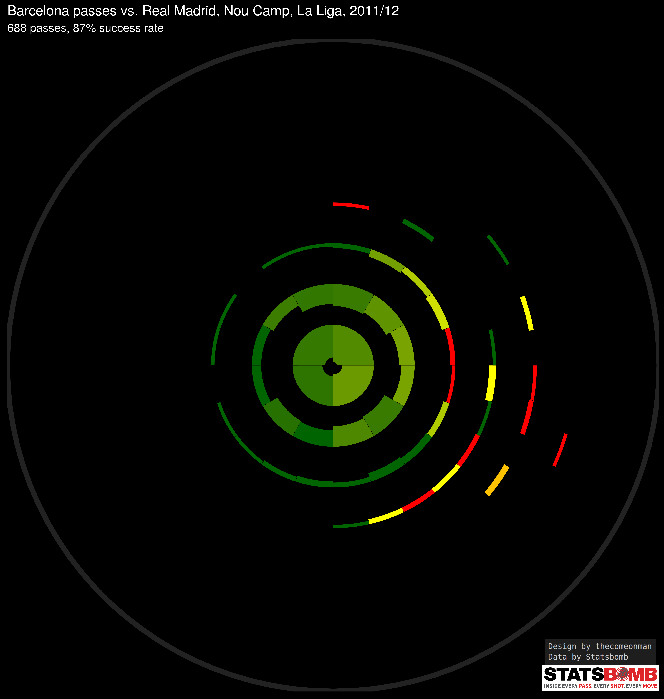
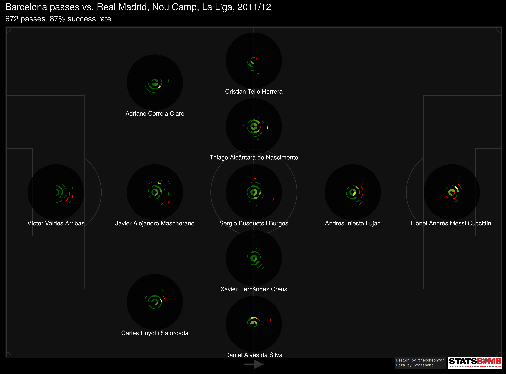

The <a href = "https://statsbomb.com/2019/07/a-sneak-peak-at-iq-tactics-a-brief-history-of-radials-sonars-wagon-wheels-in-soccer/">Statsbomb article on passing sonars</a> prominently featured the below template -


### I have three issues with this design

- The spoke of the wheel is able to communicate only one aggregated value for the length of the passes and the accuracy of the passes. By combining all the passes that were made in that angle bucket into one accuracy and one length number we lose out on a more granular view of the passes.

- There is no indication of how many passes belong to a particular sonar or spoke. Spokes with very few passes would visually get as much attention as spokes with many passes which could lead to misinterpreting the typical length or the typical success percent.

- Note how the spoke expands in width as it moves farther from the centre. This means that the longer the pass, the more area is covered by the respective spoke. For a short pass to belong to a particular spoke, it would have to fall in a far smaller region than for a long pass to belong to the same spoke. When looking at a sonar without consciously being aware of it, This may lead to misleading inferences.

### With the design below, I try to solve these problems with some more minor enhancements

- Think of the chart as a bunch of concentric rings. Each ring captures passes falling within a particular range of lengths. The rings are equally spaced so the increase in range from ring 1 to ring 2 is the same as the increase in range from any ring n to ring n + 1.

- The radius of the circle in the background of each sonar is proportional to the length of the pitch. You can use that as a reference to get an idea of how long a pass actually 

- Each block in the ring captures passes of the respective lengths in a paritcular range of direction - specifically all angles originating from the centre of the circles and passing between the left edge and right edge of the block.

- The blocks have been calculated in such a way to cover approximately the same sized area of the pitch as any other block, which is why each block spans a lesser part of the circumference on passes of longer lengths compared to the part of the circumference it covers on passes of shorter lengths.

- The thickness of each block in the ring is proportional to the number of passes of that length and angle. ( It's actuallly proportional to the square root of the number of passes, if I make it proportional then the blocks with few passes become too small to be visible. This is an acceptable workaround to me since the idea is to give an indication of the number of passes, and not really expect people to be able to infer the number of passes. )

- The colour of each block is proportional to the success percent of the passes associated with that block, going from red to dark green for 0% to 100%

- In the pitch break up, each sonar is constructed the same way as the above but captures only passes originating from that area.

### How the problems get solved

- Since we removed the spoke concept and implemented rings and blocks instead, we have some break up between passes of various length. Given that passes of different lengths are represented differently, we also get a better idea of accuracies across different pass lengths.

- Each block gives a visual cue about the number of passes falling in that length, direction combination.

- Each block is calculated in such a way that it covers approximately the same area as all other blocks which allows us to compare blocks and get an idea of which parts of the pitch received more passes and which parts received less.

### Passing Cobblestone Circles

... is what come to mind but it's unlikely to be a name that catches on so we're going to have to stick to sonar. 


```{r Setup, cache=FALSE, echo=FALSE, warning=FALSE, message=FALSE, fig.width = 15, fig.height = 8, results = 'asis'}

rm(list = ls())
library(data.table)
library(png)
library(ggplot2)
library(gridExtra)
library(grid)
library(gtable)
library(scales)
library(rjson)

vcMatchFileNames = '/home/ask/Documents/open-data/data/events/69324.json'
vcTagsToExtract = c("Starting XI",'Pass')
nLocation2Size = 80
nLocation1Size = 120

```

```{r DataIngestionFunctions, cache=FALSE, echo=FALSE, warning=FALSE, message=FALSE, fig.width = 15, fig.height = 8, results = 'asis'}


fJsonToTabular = function(
   lEvent
) {

   dtEvent = data.table(
      t(unlist(lEvent))
   )

   vcNewColnames = colnames(dtEvent)
   
   vcNewColnames = sapply(
      seq(length(vcNewColnames)),
      function ( iNewColnameIndex ) {
         
         cNewColname = vcNewColnames[iNewColnameIndex]
         
         if ( 
            sum(
               cNewColname == vcNewColnames[1:iNewColnameIndex]
            ) > 1
         ) {
            
            cNewColname = paste0(
               cNewColname,
               '.',
               formatC(
                  width = 2,
                  flag = '0',
                  sum(
                     cNewColname == vcNewColnames[1:iNewColnameIndex]
                  )
               )
            )
            
         }
         
         cNewColname
         
      }
   )

   setnames(
      dtEvent,
      vcNewColnames
   )

}


fJsonToListOfTables = function (
   lMatchJson,
   vcTagsToExtract,
   nLocation1Size = 120,
   nLocation2Size = 80
) {
   
   lEvents = list()
   
   for ( lEvent in lMatchJson ) {
   
      if ( lEvent$type$name %in% vcTagsToExtract ) {
   
         if ( lEvent$type$name %in% 'Starting XI') {
            
            dtEvent = rbindlist(
               lapply(
                  lEvent[['tactics']][['lineup']],
                  function (lEvent) {
                        
                     fJsonToTabular(
                        lEvent
                     )
                  
                  }
               )
            )
            
            lEvent[['tactics']][['lineup']] = NULL
            
         }
         
         dtEventMore = fJsonToTabular(
            lEvent
         ) 
         
         if ( exists('dtEvent')) {
         
            dtEvent = cbind(
               dtEvent,
               dtEventMore
            )
            
         } else {
            
            dtEvent = dtEventMore
            
         }
         
         rm(dtEventMore)
         
         lEvents[[lEvent$type$name]][[length(lEvents[[lEvent$type$name]]) + 1]] = dtEvent
         
         rm(lEvent)
         rm(dtEvent)
         
      }
      
   }
   
   
   for ( iEventIndex in seq(length(lEvents)) ) {

      # print(iEventIndex)

      lEvents[[iEventIndex]] = rbindlist(lEvents[[iEventIndex]], fill = T)
      
      for ( i in grep(colnames(lEvents[[iEventIndex]]), pattern = 'location1', value = T) ) {

         lEvents[[iEventIndex]][, i := as.numeric(as.character(get(i)))]
         setnames(
            lEvents[[iEventIndex]],
            i,
            'delete'
         )
         setnames(
            lEvents[[iEventIndex]],
            'i',
            i
         )
         lEvents[[iEventIndex]][, delete := NULL]

      }

      for ( i in grep(colnames(lEvents[[iEventIndex]]), pattern = 'location2', value = T) ) {

         lEvents[[iEventIndex]][, i := nLocation2Size - as.numeric(as.character(get(i)))]
         setnames(
            lEvents[[iEventIndex]],
            i,
            'delete'
         )
         setnames(
            lEvents[[iEventIndex]],
            'i',
            i
         )
         lEvents[[iEventIndex]][, delete := NULL]

      }
      
      if ( names(lEvents)[iEventIndex] == 'Pass' ) {
         
         lEvents[[iEventIndex]][, pass.angle := as.numeric(as.character(pass.angle))]
         lEvents[[iEventIndex]][, pass.length := as.numeric(as.character(pass.length))]
   
         # 0 points from defense to offense
         # pi / 2 points from centre to left
         # -pi / 2 or 3pi / 2 points from centre to right
         lEvents[[iEventIndex]][, pass.angle := -pass.angle]
         
      }
      
      if ( names(lEvents)[iEventIndex] == 'Starting XI' ) {
      
         # Attaching formation position details
         # todo - move to a separate function evnetually
         lEvents[[iEventIndex]][, location1 := as.numeric(NA)] 
         lEvents[[iEventIndex]][, location2 := as.numeric(NA)] 
         
         
         # 433 with one CDM
         viteam.id = lEvents[[iEventIndex]][
            (tactics.formation == '433' &  position.name == 'Center Defensive Midfield'), 
            unique(team.id)
         ]
         
         if ( length(viteam.id) > 0 ) {
            
            lEvents[[iEventIndex]] = merge(
               lEvents[[iEventIndex]],
               rbindlist(
                  lapply(
                     viteam.id,
                     function(iteam.id) {
                        data.table(
                           team.id = iteam.id,
                           position.name = c(
                              'Goalkeeper',
                              'Right Back','Right Center Back','Left Center Back','Left Back',
                              'Center Defensive Midfield',
                              'Right Center Midfield','Left Center Midfield',
                              'Right Wing','Center Forward', 'Left Wing'
                           ),
                           location1 = c(
                              rep(1 * nLocation1Size/5, 1), 
                              rep(2 * nLocation1Size/5, 4), 
                              rep(3 * nLocation1Size/5, 1),
                              rep(4 * nLocation1Size/5, 2),
                              rep(5 * nLocation1Size/5, 3)
                           ) - ( (nLocation1Size/5) / 2),
                           location2 = c(
                              ( c(1) - 0.5 ) * ( nLocation2Size / 1 ), 
                              ( c(1:4) - 0.5 ) * ( nLocation2Size / 4 ), 
                              ( c(1) - 0.5 ) * ( nLocation2Size / 1 ), 
                              ( c(1:2) - 0.5 ) * ( nLocation2Size / 2 ), 
                              ( c(1:3) - 0.5 ) * ( nLocation2Size / 3 )
                           )
                        )
                     }
                  )
               ),
               c('team.id','position.name'),
               suffixes = c('','.new')
            )
            
            lEvents[[iEventIndex]][is.na(location1), location1 := location1.new]
            lEvents[[iEventIndex]][is.na(location2), location2 := location2.new]
            lEvents[[iEventIndex]][, c('location1.new','location2.new') := NULL]
            
         }
         
         
         
         # 3511
         viteam.id = lEvents[[iEventIndex]][
            (tactics.formation == '3511'), 
            unique(team.id)
         ]
         
         if ( length(viteam.id) > 0 ) {
            
            lEvents[[iEventIndex]] = merge(
               lEvents[[iEventIndex]],
               rbindlist(
                  lapply(
                     viteam.id,
                     function(iteam.id) {
                        
                        data.table(
                           team.id = iteam.id,
                           position.name = c(
                              'Goalkeeper',
                              'Right Center Back','Center Back','Left Center Back',
                              'Right Wing Back','Right Center Midfield','Center Defensive Midfield','Left Center Midfield','Left Wing Back',
                              'Center Attacking Midfield',
                              'Center Forward'
                           ),
                           location1 = c(
                              rep(1 * nLocation1Size/5, 1), 
                              rep(2 * nLocation1Size/5, 3), 
                              rep(3 * nLocation1Size/5, 5),
                              rep(4 * nLocation1Size/5, 1),
                              rep(5 * nLocation1Size/5, 1)
                           ) - ( (nLocation1Size/5) / 2),
                           location2 = c(
                              ( c(1:1) - 0.5 ) * ( nLocation2Size / 1 ), 
                              ( c(1:3) - 0.5 ) * ( nLocation2Size / 3 ), 
                              ( c(1:5) - 0.5 ) * ( nLocation2Size / 5 ), 
                              ( c(1:1) - 0.5 ) * ( nLocation2Size / 1 ), 
                              ( c(1:1) - 0.5 ) * ( nLocation2Size / 1 )
                           )
                        )
                        
                     }
                  )
               ),
               c('team.id','position.name'),
               suffixes = c('','.new')
            )
            
            lEvents[[iEventIndex]][is.na(location1), location1 := location1.new]
            lEvents[[iEventIndex]][is.na(location2), location2 := location2.new]
            lEvents[[iEventIndex]][, c('location1.new','location2.new') := NULL]
            
         }
         
      }      

   }
   
   names(lEvents) = make.names(names(lEvents))
   
   lEvents
   
}


```

```{r ChartFunctions, cache=FALSE, echo=FALSE, warning=FALSE, message=FALSE, fig.width = 15, fig.height = 8, results = 'asis'}

# Adds pitch markings, green background, etc. for plot background to look like
# a football pitch.
fAddPitchLines = function (
   plotObject,
   nXLimit = 105,
   nYLimit = 68,
   cLineColour = 'white',
   cPitchColour = '#038253'
) {

   nPenaltyAreaLength_m = nXLimit * 16.5 / 105
   nPenaltyAreaWidth_m = nYLimit * 40 / 68
   nSixYardBoxLength_m = nXLimit * 5.5 / 105
   nSixYardBoxWidth_m = nYLimit * 18 / 68
   nCentreCircleRadius_m = nXLimit * 9.15 / 105
   nPenaltySpotOffset_m = nXLimit * 11 / 105
   nCornerArcRadius_m = nXLimit * 1 / 105

   dtCentreCircle = data.table(
      Angle_rad = seq(
         0,
         2*pi,
         0.01
      )
   )[,
      x := ( 
         nCentreCircleRadius_m * sin(Angle_rad)
      ) + ( nXLimit / 2 )
   ][,
      y := ( 
         nCentreCircleRadius_m * cos(Angle_rad)
      ) + ( 
         nYLimit / 2
      )
   ]

   dtCornerArc = data.table(
      Angle_rad = seq(
         0,
         pi/2,
         0.01
      )
   )[,
      x := ( 
         nCornerArcRadius_m * sin(Angle_rad)
      )
   ][,
      y := ( 
         nCornerArcRadius_m * cos(Angle_rad)
      )
   ]

   
   plotObject = plotObject +
      # background
      geom_rect(
         aes(
            xmin = 0 - 5, 
            ymin = 0 - 5,
            xmax = nXLimit + 5,
            ymax = nYLimit + 5
         ),
         fill = cPitchColour
      ) +
      # pitch
      geom_rect(
         aes(
            xmin = 0, 
            ymin = 0,
            xmax = nXLimit,
            ymax = nYLimit
         ),
         fill = cPitchColour,
         color = cLineColour
      ) +
      # D defense 
      geom_polygon(
         data = dtCentreCircle,
         aes(
            x = x - ( nXLimit / 2) + nPenaltySpotOffset_m,
            y = y
         ),
         color = cLineColour,
         fill = cPitchColour
      ) +
      # D offense 
      geom_polygon(
         data = dtCentreCircle,
         aes(
            x = x + ( nXLimit / 2) - nPenaltySpotOffset_m,
            y = y
         ),
         color = cLineColour,
         fill = cPitchColour
      ) +
      # penalty box defense
      geom_rect(
         aes(
            ymin = ( nYLimit / 2 ) - ( nPenaltyAreaWidth_m / 2 ), 
            ymax = ( nYLimit / 2 ) + ( nPenaltyAreaWidth_m / 2 ),
            xmin = 0,
            xmax = nPenaltyAreaLength_m
         ),
         # alpha = 0,
         color = cLineColour,
         fill = cPitchColour
      ) +
      # penalty box attack
      geom_rect(
         aes(
            ymin = ( nYLimit / 2 ) - ( nPenaltyAreaWidth_m / 2 ), 
            ymax = ( nYLimit / 2 ) + ( nPenaltyAreaWidth_m / 2 ),
            xmin = nXLimit,
            xmax = nXLimit - nPenaltyAreaLength_m
         ),
         # alpha = 0,
         color = cLineColour,
         fill = cPitchColour
      ) +
      # six yard box defense
      geom_rect(
         aes(
            ymin = ( nYLimit / 2 ) - ( nSixYardBoxWidth_m / 2 ), 
            ymax = ( nYLimit / 2 ) + ( nSixYardBoxWidth_m / 2 ),
            xmin = 0,
            xmax = nSixYardBoxLength_m
         ),
         # alpha = 0,
         color = cLineColour,
         fill = cPitchColour
      ) +
      # six yard attack
      geom_rect(
         aes(
            ymin = ( nYLimit / 2 ) - ( nSixYardBoxWidth_m / 2 ), 
            ymax = ( nYLimit / 2 ) + ( nSixYardBoxWidth_m / 2 ),
            xmin = nXLimit,
            xmax = nXLimit - nSixYardBoxLength_m
         ),
         # alpha = 0,
         color = cLineColour,
         fill = cPitchColour
      ) +
      # centre circle
      # this doesn't work, size changes with plot size
      # geom_point(
      #    aes(x = nXLimit / 2, y = nYLimit / 2),
      #    size = 30, 
      #    shape = 1, 
      #    color = "white"
      # ) +
      # penalty spot defense
      geom_point(
         aes(
            x = nPenaltySpotOffset_m,
            y = ( nYLimit / 2 )
         ),
         color = cLineColour
      ) +
      # penalty spot offense
      geom_point(
         aes(
            x = nXLimit - nPenaltySpotOffset_m,
            y = ( nYLimit / 2 )
         ),
         color = cLineColour
      ) +
      # centre circle
      geom_polygon(
         data = dtCentreCircle,
         aes(
            x = x,
            y = y
         ),
         color = cLineColour,
         alpha = 0
      ) +
      # centre line
      geom_segment(
         aes(
            x = nXLimit / 2,
            xend = nXLimit / 2,
            y = 0,
            yend = nYLimit
         ),
         color = cLineColour
      ) +
      # centre spot
      geom_point(
         aes(
            x = ( nXLimit / 2 ),
            y = ( nYLimit / 2 )
         ),
         color = cLineColour
      ) + 
      # left bottom corner arc
      geom_path(
         data = dtCornerArc,
         aes(
            x = x,
            y = y
         ),
         color = cLineColour
         # alpha = 0
      ) +
      # left top corner arc
      geom_path(
         data = dtCornerArc,
         aes(
            x = x,
            y = nYLimit - y
         ),
         color = cLineColour
      ) +
      # right bottom corner arc
      geom_path(
         data = dtCornerArc,
         aes(
            x = nXLimit - x,
            y = y
         ),
         color = cLineColour
      ) +
      # right top corner arc
      geom_path(
         data = dtCornerArc,
         aes(
            x = nXLimit - x,
            y = nYLimit - y
         ),
         color = cLineColour
      ) +
      # direction of attack
      geom_rect(
         data = data.table(
            x = ( nXLimit / 2 ) - ( nXLimit * 2 / 105 ),
            xend = ( nXLimit / 2 ) + ( nXLimit * 2 / 105 ),
            y = ( nYLimit * -2.5 / 68 ) + ( nXLimit * 0.9 / 105 ),
            yend = ( nYLimit * -2.5 / 68 ) + ( nXLimit * 1.1 / 105 )
         ),
         aes(
            xmin = x,
            xmax = xend,
            ymin = y,
            ymax = yend
         ),
         # arrow = arrow(length = unit(0.03, "npc")),
         color = cLineColour
      ) +
      geom_polygon(
         data = data.table(
            x = c(
               ( nXLimit / 2 ),
               ( nXLimit / 2 ) + ( nXLimit * 2 / 105 ),
               ( nXLimit / 2 )
            ),
            y = c(
               nYLimit * -2.5 / 68,
               ( nYLimit * -2.5 / 68 ) + ( nXLimit * 1 / 105 ),
               ( nYLimit * -2.5 / 68 ) + ( nXLimit * 2 / 105 )
            )
         ),
         aes(
            x = x,
            y = y
         ),
         fill = cLineColour
      ) +
      xlab(NULL) + 
      ylab(NULL) + 
      coord_fixed()

   return ( plotObject )

}

# Lipstick for the pitch background plots
theme_pitch <- function () { 

   theme_bw(
      base_size = 12
   ) + 
      theme(
         # panel.background = element_rect(
         #    fill = "white", 
         #    colour = NA
         # ),
         plot.background = element_rect(fill = "white", colour = NA), 
         legend.background = element_rect(fill = "transparent", colour = NA),
         legend.key = element_rect(fill = "transparent", colour = NA),
         plot.caption = element_text(hjust = 0),
         axis.title.x = element_blank(),
         axis.text.x = element_blank(),
         axis.ticks.x = element_blank(),
         axis.title.y = element_blank(),
         axis.text.y = element_blank(),
         axis.ticks.y = element_blank(),
         axis.line = element_line(colour = "black"),
         panel.grid.major = element_blank(),
         panel.grid.minor = element_blank(),
         # panel.border = element_blank(),
         panel.background = element_blank()
      )

}

# Draws a block based on the angle bucket and length bucket, respectively 
# indicated by x and y
fCalculatePolygonCoordinate = function (
   xmin2,
   xmax2,
   ymin2,
   ymax2,
   fTrigFunction
) {
   
   c(
      seq(
         ymin2,
         ymax2,
         ( ymax2 - ymin2 ) / 50
      ) * fTrigFunction(xmin2),
      fTrigFunction(
         seq(
            xmin2,
            xmax2,
            ( xmax2 - xmin2 ) / 50
         )
      ) * ymax2,
      seq(
         ymax2,
         ymin2,
         ( ymin2 - ymax2 ) / 50
      ) * fTrigFunction(xmax2),
      fTrigFunction(
         seq(
            xmax2,
            xmin2,
            ( xmin2 - xmax2 ) / 50
         )
      ) * ymin2
   )
   
}

# This function has only been tested with 120 X 80 dimension dataset, in the 
# two ways shown in the charts section. Any deviation from those may 
# produce odd results.
fPlotSonar = function (
   dtPassesToPlot,
   iBlocksInFirstRing = 4,
   iNbrRings = 8,
   nLocation2Size = 80,
   nLocation1Size = 120,
   bAddPitchBackground = F,
   cTitle = NULL
) {
   
   dtPasses = copy(dtPassesToPlot)
   
   nIncremntalRingRadius = nLocation1Size / iNbrRings
   
   # A vector with the same length as the number of rings possible, with each
   # element having the radius for that ring
   vnPassLengthBreaks = seq(0, nLocation1Size, nIncremntalRingRadius)
   
   # Each ring, depepnding on the radius, will have different number of breaks
   # to capture passes of the respective length but in a certain direction
   # This logic calculates the number of breaks at each ring
   vnPiR2Difference = ( (tail(vnPassLengthBreaks, -1) ^ 2) - (head(vnPassLengthBreaks, -1) ^ 2) ) 
   viNbrAngleBreaks = round(vnPiR2Difference / ( vnPiR2Difference[1] / iBlocksInFirstRing ))

   # The coordinates of the pitch will need to be extended to fit multiple
   # sonars in it, since each sonar will individually have a span of 
   # (-length,length).
   # The pitch will be extended to nZoomFactor the dimensions to 
   # accommodate all the sonars.
   nZoomFactor = ceiling(
      max(
         dtPasses[, length(unique(location1.bucket))], 
         dtPasses[, length(unique(location2.bucket)), location1.bucket][, max(V1)],
         ( nLocation1Size * dtPasses[, length(unique(location2.bucket)), location1.bucket][, max(V1)] ) / nLocation2Size
      )
   ) 
   nZoomFactor = nZoomFactor * 2 *  1.1
   
   # Length bucket number. The bucket number, and not the bucket, is needed
   # to calculate the angle buckets.
   dtPasses[, 
      pass.length.bucket := pass.length %/% nIncremntalRingRadius
   ]
   
   # Angle buckets.
   # Basically retrieving the number of angle buckets for the resepctive ring
   # which are already calculated in viNbrAngleBreaks and labelling the
   # data accordingly.
   dtPasses[, 
      pass.angle.bucket := pass.angle %/% ( 
         2 * pi / viNbrAngleBreaks[ 1 + pass.length.bucket ] 
      ),
      pass.length.bucket
   ]
   
   # When angle is exactly 2pi, it falls into a bucket which has only 2*pi 
   # angle passes. Forcing them to the previous bucket. Will live with this
   # inconsistency.
   # Not just comparing angle == 2pi because of precision affecting the result
   # of that comparison
   dtPasses[, 
      pass.angle.bucket := ifelse(
         pass.angle.bucket == ( 2 * pi) %/% (
            2 * pi / viNbrAngleBreaks[ 1 + pass.length.bucket ]
         ),
         pass.angle.bucket - 1,
         pass.angle.bucket
      ),
      pass.length.bucket
   ]
   
   dtPasses[, 
      pass.angle.bucket.width := (
         2 * pi / viNbrAngleBreaks[ 1 + pass.length.bucket ] 
      ), 
      pass.length.bucket
   ]
   
   dtPasses[, 
      pass.angle.bucket := ( pass.angle.bucket + 0.5 ) * pass.angle.bucket.width
   ]
   
   # Calculating actual pass length buckets
   dtPasses[, 
      pass.length.bucket := ( pass.length.bucket + 0.5 ) * nIncremntalRingRadius, 
      pass.length.bucket
   ]
   
   # Preparing the polygons needed for various elements of the chart
   dtAllShapes = dtPasses[
      # Remove throws in, etc. otherwise they might show up beyond
      # the touchlines.
      location1 < nLocation1Size &
      location2 < nLocation2Size
   ][
      # Some passes don't have this data
      !is.na(pass.length.bucket) &
      !is.na(pass.angle.bucket)
   ][, 
      list(
         PassCount = .N, 
         Success_pct = sum(is.na(pass.outcome.name)) / .N
      ),
      list(
         location1.bucket,
         location2.bucket,
         pass.angle.bucket, 
         pass.angle.bucket.width,
         pass.length.bucket,
         # the bucket values are defined at the centre of the respective
         # dimension so the min and max span would need to be calcualted
         xmin = pass.angle.bucket - ( pass.angle.bucket.width / 2 ),
         xmax = pass.angle.bucket + ( pass.angle.bucket.width / 2 ),
         ymin = pass.length.bucket - ( nIncremntalRingRadius / 2 ),
         ymax = pass.length.bucket + ( nIncremntalRingRadius / 2 )
      )
   ]
   
   # Changing the dimensions of the block based on the number of passes 
   # in that block such that the outer boundary extends all the way to the max
   # radius the ring permits and the inner radius is moved
   dtAllShapes[,
      ymin2 := pass.length.bucket + 
        ( nIncremntalRingRadius * 1 / 2 ) - 
        ( nIncremntalRingRadius * sqrt( PassCount / ( 1.2 * max(PassCount) ) ) )
   ][,
      ymax2 := pass.length.bucket + ( nIncremntalRingRadius * 1 / 2 )
   ][,
      xmin2 := pass.angle.bucket - ( pass.angle.bucket.width * 1 / 2 )
   ][,
      xmax2 := pass.angle.bucket + ( pass.angle.bucket.width * 1 / 2 )
   ]
   
   
   # Changed both height and width of the block
   # dtAllShapes[,
   #    xmin2 := pass.angle.bucket - ( pass.angle.bucket.width * sqrt( PassCount / max(PassCount) ) / 2 )
   # ][,
   #    xmax2 := pass.angle.bucket + ( pass.angle.bucket.width * sqrt( PassCount / max(PassCount) ) / 2 )
   # ][,
   #    ymin2 := pass.length.bucket - ( nIncremntalRingRadius * sqrt( PassCount / max(PassCount) ) / 2 )
   # ][,
   #    ymax2 := pass.length.bucket + ( nIncremntalRingRadius * sqrt( PassCount / max(PassCount) ) / 2 )
   # ]
   
   # Changed width of the block and kept height constant
   # dtAllShapes[,
   #    ymin3 := pass.length.bucket - ( nIncremntalRingRadius * 1 / 2 )
   # ][,
   #    ymax3 := pass.length.bucket + ( nIncremntalRingRadius * 1 / 2 )
   # ][,
   #    xmin3 := pass.angle.bucket - ( pass.angle.bucket.width * sqrt( PassCount / ( 1.2 * max(PassCount) ) ) / 2 )
   # ][,
   #    xmax3 := pass.angle.bucket + ( pass.angle.bucket.width * sqrt( PassCount / ( 1.2 * max(PassCount) ) ) / 2 )
   # ]
   
   # Going from the four corner coordinates to a set of points that trace out
   # the entire block. Just the four coordinates would draw a quadrangle but
   # we need an arced sort of a quadrangle which is why we need this.
   dtAllShapes = dtAllShapes[,
      list(
         # The coordinates of the block, scaled for number of passes
         x = fCalculatePolygonCoordinate (
            xmin2,
            xmax2,
            ymin2,
            ymax2,
            fTrigFunction = cos
         ),
         y = fCalculatePolygonCoordinate (
            xmin2,
            xmax2,
            ymin2,
            ymax2,
            fTrigFunction = sin
         ),
         # The coordinates of the black for the max area possible for it
         # Can be used to add a boundary to blocks maybe.
         xBound = fCalculatePolygonCoordinate (
            xmin,
            xmax,
            ymin,
            ymax,
            fTrigFunction = cos
         ),
         yBound = fCalculatePolygonCoordinate (
            xmin,
            xmax,
            ymin,
            ymax,
            fTrigFunction = sin
         )
      ),
      list(
         # Moving the bucket coordinates so that they fit on the 
         # stretched out pitch
         location1.bucket = location1.bucket * nZoomFactor,
         location2.bucket = location2.bucket * nZoomFactor,
         PassCount,
         Success_pct,
         pass.angle.bucket,
         pass.length.bucket
      )
   ]
   
   # Initialising plot
   p1 = ggplot(
      dtAllShapes
   )
   
   # Adding a football pitch in the background.
   if ( bAddPitchBackground ) {
      
      p1 = fAddPitchLines(
         p1, 
         nXLimit = nZoomFactor * nLocation1Size, 
         nYLimit = nZoomFactor * nLocation2Size,
         cPitchColour = '#111111', 
         cLineColour = '#333333'
      )
      
   } else {
   
      # If the pitch isn't being added, then the coord_fixed will need to be 
      # specified explicitly
         
      p1 = p1 + coord_fixed()
      
   }
   
   
   
   # If it's only one sonar, i.e. not multiple blocks, then the background
   # of the plot will need some distinction from the ring around the sonar
   # Adding the background and ring around the sonar for that.
   p1 = p1 + 
      geom_polygon(
         data = dtPasses[
            location1 < nLocation1Size &
            location2 < nLocation2Size
         ][,
            list(
               x = max( nLocation1Size, nLocation2Size ) * cos(seq(-pi, pi, pi / 50)),
               y = max( nLocation1Size, nLocation2Size ) * sin(seq(-pi, pi, pi / 50))
            ),
            list(
               location1.bucket = location1.bucket * nZoomFactor,
               location2.bucket = location2.bucket * nZoomFactor
             )
         ],
         aes(
            x = x + location1.bucket,
            y = y + location2.bucket,
            group = paste0(
               location1.bucket,
               location2.bucket
            )
        ),
        fill = '#000000',
        alpha = ifelse(
           dtPasses[, length(unique(location1.bucket))] == 1 &
           dtPasses[, length(unique(location2.bucket))] == 1,
           0,
           0.8
        ),
        color = ifelse(
           dtPasses[, length(unique(location1.bucket))] == 1 &
           dtPasses[, length(unique(location2.bucket))] == 1,
           '#222222',
           NA
        ),
        size = ifelse(
           dtPasses[, length(unique(location1.bucket))] == 1 &
           dtPasses[, length(unique(location2.bucket))] == 1,
           3,
           0
        )
      )
   
   p1 = p1 +
      # marking a centre point
      geom_point(
        aes(
            x = location1.bucket,
            y = location2.bucket
        ),
        color = '#000000'
      ) +
      # passing block
      geom_polygon(
        aes(
            x = x + location1.bucket,
            y = y + location2.bucket,
            fill = Success_pct,
            group = paste0(
               location1.bucket,
               location2.bucket,
               pass.angle.bucket,
               pass.length.bucket
            )
        ),
        color = 'black',
        size = 0.1
        # alpha = 0.8
      ) +
      scale_fill_gradient2(
         # low = '#89cff0',
         # low = '#0070bb',
         # mid = 'yellow',
         # high = 'red',
         low = 'red',
         mid = 'yellow',
         high = '#006400',
         midpoint = 0.5, 
         name = 'Success %', 
         labels = percent, 
         guide = 'none',
         limits = c(0, 1)
      ) +
      # To prevent gaps around the edges of the blot
      scale_x_continuous(expand=c(0,0)) +
      scale_y_continuous(expand=c(0,0)) +
      # aesthetic adjustments
      theme_pitch() +
      theme(
         plot.background = element_rect(fill = '#000000', color = NA),
         panel.background = element_rect(fill = '#000000', color = NA),
         panel.border = element_blank(),
         axis.line = element_blank(),
         legend.text = element_text(colour = 'white'),
         # legend.background = element_rect(fill = '#000000'),
         legend.title = element_text(colour = 'white'),
         title = element_text(size = 14, colour = 'white')
      ) +
      # supporting text
      labs(
         title = cTitle,
         subtitle = paste0(
            nrow(dtPasses), ' passes, ',
            round(100 * dtPasses[, sum(is.na(pass.outcome.name)) / .N]), '% success rate'
         )
      )
   
   p1

}


```


```{r Data, cache=FALSE, echo=FALSE, warning=FALSE, message=FALSE, fig.width = 15, fig.height = 8, results = 'asis'}

lMatches = lapply(
   vcMatchFileNames,
   function ( cMatchFileName ) {
         
      lMatchJson = fromJSON(file = cMatchFileName)
   
      lEvents = fJsonToListOfTables (
         lMatchJson,
         vcTagsToExtract
      ) 
      
      lEvents = lapply(
         lEvents,
         function ( dtEvents ) {
            
            dtEvents[, 
               match_id := gsub(
                  x = gsub(
                     x = cMatchFileName,
                     pattern = '\\.json',
                     replacement = ''
                  ),
                  pattern = '.*\\/',
                  replacement = ''
               )
            ]
            
         }
      )
      
      lEvents
      
   }
   
)

names(lMatches) = gsub(
   x = gsub(
      x = vcMatchFileNames,
      pattern = '\\.json',
      replacement = ''
   ),
   pattern = '.*\\/',
   replacement = ''
)

# filtering out Barcelona performances
lMatches = lapply(
   lMatches,
   function( lMatch ) {
      
      lapply(
         lMatch,
         function ( dtEvent ) {
            
            dtEvent = dtEvent[team.id == 217]
            
         }
      )
   }
)

# dtPasses = dtEvent[, 
#    list(
#       # optional
#       id, index, team.id, team.name, player.id, player.name, pass.end_location1, pass.end_location2, 
#       # mandatory
#       pass.length, pass.angle, location1, location2, pass.outcome.name
#    )
# ]
# rm(dtEvent)


```

```{r, Charts, cache=FALSE, echo=FALSE, warning=FALSE, message=FALSE, fig.width = 15, fig.height = 8, results = 'asis'}

plotPitchBreakupSonar = fPlotSonar (
   dtPassesToPlot = lMatches[[1]]$Pass[,
      list(
         location1,
         location2,
         pass.angle,
         pass.length,
         pass.outcome.name,
         location1.bucket = (
            ifelse(
               location1 %/% 20 == nLocation1Size %/% 20,
               ( location1 %/% 20 ) - 1,
               location1 %/% 20
            ) * 20
         ) + 10,
         location2.bucket = ( 
            ifelse(
               location2 %/% 20 == nLocation2Size %/% 20,
               ( location2 %/% 20 ) - 1,
               location2 %/% 20
            ) * 20
         ) + 10
      )
   ],
   iBlocksInFirstRing = 4,
   iNbrRings = 8,
   nLocation2Size = 80,
   nLocation1Size = 120,
   bAddPitchBackground = T,
   cTitle = 'Barcelona passes vs. Real Madrid, Nou Camp, La Liga, 2011/12'
)


plotPlayerBreakupSonar = fPlotSonar (
   dtPassesToPlot = merge(
      lMatches[[1]]$Pass,
      lMatches[[1]]$Starting.XI[, list(match_id, team.id, player.id, location1.bucket = location1, location2.bucket = location2)],
      c('match_id','team.id','player.id')
   ),
   iBlocksInFirstRing = 4,
   iNbrRings = 8,
   nLocation2Size = 80,
   nLocation1Size = 120,
   bAddPitchBackground = T,
   cTitle = 'Barcelona passes vs. Real Madrid, Nou Camp, La Liga, 2011/12'
)

plotOverallSonar = fPlotSonar (
   dtPassesToPlot = lMatches[[1]]$Pass[,
      list(
         location1,
         location2,
         pass.angle,
         pass.length,
         pass.outcome.name,
         location1.bucket = nLocation1Size / 2,
         location2.bucket = nLocation2Size / 2
      )
   ],
   iBlocksInFirstRing = 4,
   iNbrRings = 8,
   nLocation2Size = 80,
   nLocation1Size = 120,
   bAddPitchBackground = F,
   cTitle = 'Barcelona passes vs. Real Madrid, Nou Camp, La Liga, 2011/12'
)


```

```{r, Watermarks, cache=FALSE, echo=FALSE, warning=FALSE, message=FALSE, fig.width = 15, fig.height = 8, results = 'asis'}

pngStatsbombLogo = readPNG('/home/ask/Documents/open-data/stats-bomb-logo.png') 
rasterStatsbombLogo <- rasterGrob(pngStatsbombLogo, interpolate=TRUE)

pngCredits = readPNG('/home/ask/Pictures/Screenshot from 2019-08-21 08-08-08.png') 
rasterCredits <- rasterGrob(pngCredits, interpolate=TRUE)

plotPitchBreakupSonar = plotPitchBreakupSonar + 
   annotation_custom(
      rasterStatsbombLogo,
      ymin = ggplot_build(plotPitchBreakupSonar)$layout$panel_params[[1]]$y.range[1],
      ymax = 0,
      xmin = ggplot_build(plotPitchBreakupSonar)$layout$panel_params[[1]]$x.range[2] - ( abs(ggplot_build(plotPitchBreakupSonar)$layout$panel_params[[1]]$y.range[1]) * 1485 / 330 ),
      xmax = ggplot_build(plotPitchBreakupSonar)$layout$panel_params[[1]]$x.range[2]
   )

plotPitchBreakupSonar = plotPitchBreakupSonar + 
   annotation_custom(
      rasterCredits,
      ymin = ggplot_build(plotPitchBreakupSonar)$layout$panel_params[[1]]$y.range[1],
      ymax = 0,
      xmin = ggplot_build(plotPitchBreakupSonar)$layout$panel_params[[1]]$x.range[2] - ( 2 * abs(ggplot_build(plotPitchBreakupSonar)$layout$panel_params[[1]]$y.range[1]) * 1485 / 330 ),
      xmax = ggplot_build(plotPitchBreakupSonar)$layout$panel_params[[1]]$x.range[2] - ( 1 * abs(ggplot_build(plotPitchBreakupSonar)$layout$panel_params[[1]]$y.range[1]) * 1485 / 330 )
   )


plotPlayerBreakupSonar = plotPlayerBreakupSonar + 
   annotation_custom(
      rasterStatsbombLogo,
      ymin = ggplot_build(plotPlayerBreakupSonar)$layout$panel_params[[1]]$y.range[1],
      ymax = 0,
      xmin = ggplot_build(plotPlayerBreakupSonar)$layout$panel_params[[1]]$x.range[2] - ( abs(ggplot_build(plotPlayerBreakupSonar)$layout$panel_params[[1]]$y.range[1]) * 1485 / 330 ),
      xmax = ggplot_build(plotPlayerBreakupSonar)$layout$panel_params[[1]]$x.range[2]
   )

plotPlayerBreakupSonar = plotPlayerBreakupSonar + 
   annotation_custom(
      rasterCredits,
      ymin = ggplot_build(plotPlayerBreakupSonar)$layout$panel_params[[1]]$y.range[1],
      ymax = 0,
      xmin = ggplot_build(plotPlayerBreakupSonar)$layout$panel_params[[1]]$x.range[2] - ( 2 * abs(ggplot_build(plotPlayerBreakupSonar)$layout$panel_params[[1]]$y.range[1]) * 1485 / 330 ),
      xmax = ggplot_build(plotPlayerBreakupSonar)$layout$panel_params[[1]]$x.range[2] - ( 1 * abs(ggplot_build(plotPlayerBreakupSonar)$layout$panel_params[[1]]$y.range[1]) * 1485 / 330 )
   )


plotOverallSonar = plotOverallSonar + 
   annotation_custom(
      rasterStatsbombLogo,
      ymin = ggplot_build(plotOverallSonar)$layout$panel_params[[1]]$y.range[1],
      ymax = ggplot_build(plotOverallSonar)$layout$panel_params[[1]]$y.range[1] + ( diff(ggplot_build(plotOverallSonar)$layout$panel_params[[1]]$y.range) * 0.04 ),
      xmin = ggplot_build(plotOverallSonar)$layout$panel_params[[1]]$x.range[2] - ( ( diff(ggplot_build(plotOverallSonar)$layout$panel_params[[1]]$y.range) * 0.04 ) * 1485 / 330 ),
      xmax = ggplot_build(plotOverallSonar)$layout$panel_params[[1]]$x.range[2]
   )

plotOverallSonar = plotOverallSonar + 
   annotation_custom(
      rasterCredits,
      ymin = ggplot_build(plotOverallSonar)$layout$panel_params[[1]]$y.range[1] + ( diff(ggplot_build(plotOverallSonar)$layout$panel_params[[1]]$y.range) * 0.04 ),
      ymax = ggplot_build(plotOverallSonar)$layout$panel_params[[1]]$y.range[1] + ( diff(ggplot_build(plotOverallSonar)$layout$panel_params[[1]]$y.range) * 0.04 * 2),
      xmin = ggplot_build(plotOverallSonar)$layout$panel_params[[1]]$x.range[2] - ( ( diff(ggplot_build(plotOverallSonar)$layout$panel_params[[1]]$y.range) * 0.04 ) * 1485 / 330 ),
      xmax = ggplot_build(plotOverallSonar)$layout$panel_params[[1]]$x.range[2]
   )


if ( F ) {
      
   ggsave(
      plot = plotOverallSonar,
      filename = 'plotOverallSonar.png', 
      width = 285, 
      height = 300, 
      dpi = 450,
      units = 'mm'
   )
      
   # this takes veeeeeeeery long
   ggsave(
      plot = plotPitchBreakupSonar,
      filename = 'plotPitchBreakupSonar.png', 
      width = 320, 
      height = 237, 
      units = 'mm',
      dpi = 450
   )
   
   # this takes veeeeeeeery long
   ggsave(
      plot = plotPlayerBreakupSonar,
      filename = 'plotPlayerBreakupSonar.png', 
      width = 320, 
      height = 237, 
      units = 'mm',
      dpi = 450
   )
   
}

```

( opening images in a new tab by themselves might be a better view )

```{r, ChartRenders, cache=FALSE, echo=FALSE, warning=FALSE, message=FALSE, out.width = 1500, results = 'asis'}


knitr::include_graphics("./plotPitchBreakupSonar.png")


```