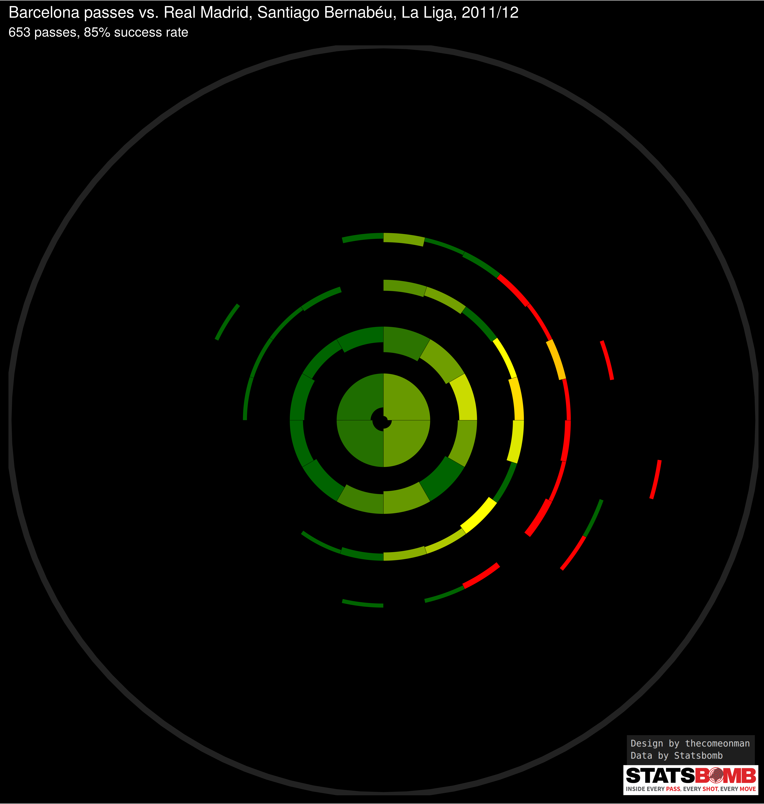
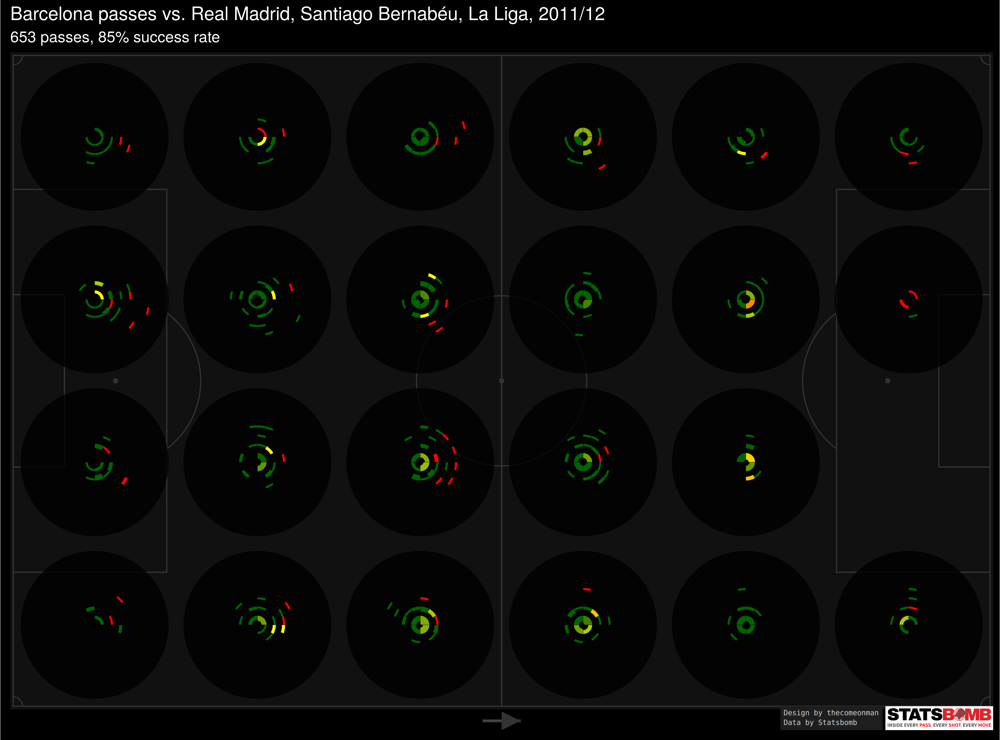
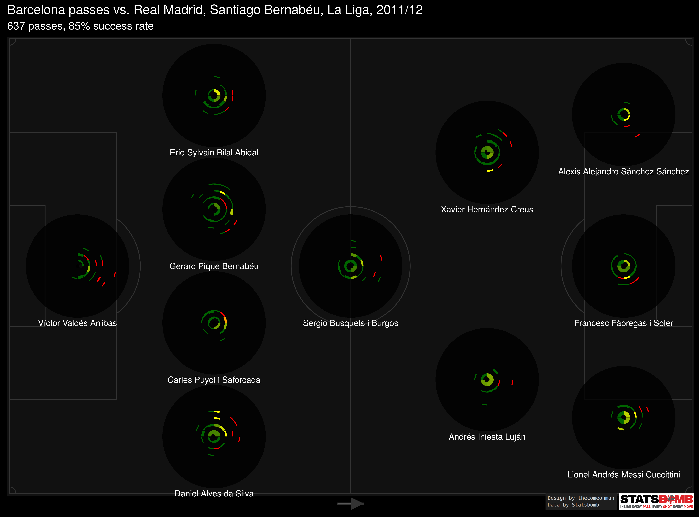

The
<a href = "https://statsbomb.com/2019/07/a-sneak-peak-at-iq-tactics-a-brief-history-of-radials-sonars-wagon-wheels-in-soccer/">Statsbomb
article on passing sonars</a> prominently featured the below template -

### I have three issues with this design

-   The spoke of the wheel is able to communicate only one aggregated
    value for the length of the passes and the accuracy of the passes.
    By combining all the passes that were made in that angle bucket into
    one accuracy and one length number we lose out on a more granular
    view of the passes.

-   There is no indication of how many passes belong to a particular
    sonar or spoke. Spokes with very few passes would visually get as
    much attention as spokes with many passes which could lead to
    misinterpreting the typical length or the typical success percent.

-   Note how the spoke expands in width as it moves farther from the
    centre. This means that the longer the pass, the more area is
    covered by the respective spoke. For a short pass to belong to a
    particular spoke, it would have to fall in a far smaller region than
    for a long pass to belong to the same spoke. When looking at a sonar
    without consciously being aware of it, This may lead to misleading
    inferences.

### With the design below, I try to solve these problems with some more minor enhancements

-   Think of the chart as a bunch of concentric rings. Each ring
    captures passes falling within a particular range of lengths. The
    rings are equally spaced so the increase in range from ring 1 to
    ring 2 is the same as the increase in range from any ring n to ring
    n + 1.

-   The radius of the circle in the background of each sonar is
    proportional to the length of the pitch. You can use that as a
    reference to get an idea of how long a pass actually

-   Each block in the ring captures passes of the respective lengths in
    a paritcular range of direction - specifically all angles
    originating from the centre of the circles and passing between the
    left edge and right edge of the block.

-   The blocks have been calculated in such a way to cover approximately
    the same sized area of the pitch as any other block, which is why
    each block spans a lesser part of the circumference on passes of
    longer lengths compared to the part of the circumference it covers
    on passes of shorter lengths.

-   The thickness of each block in the ring is proportional to the
    number of passes of that length and angle. ( It’s actuallly
    proportional to the square root of the number of passes, if I make
    it proportional then the blocks with few passes become too small to
    be visible. This is an acceptable workaround to me since the idea is
    to give an indication of the number of passes, and not really expect
    people to be able to infer the number of passes. )

-   The colour of each block is proportional to the success percent of
    the passes associated with that block, going from red to dark green
    for 0% to 100%

-   In the pitch break up, each sonar is constructed the same way as the
    above but captures only passes originating from that area.

### How the problems get solved

-   Since we removed the spoke concept and implemented rings and blocks
    instead, we have some break up between passes of various length.
    Given that passes of different lengths are represented differently,
    we also get a better idea of accuracies across different pass
    lengths.

-   Each block gives a visual cue about the number of passes falling in
    that length, direction combination.

-   Each block is calculated in such a way that it covers approximately
    the same area as all other blocks which allows us to compare blocks
    and get an idea of which parts of the pitch received more passes and
    which parts received less.

### Passing Cobblestone Circles

… is what come to mind but it’s unlikely to be a name that catches on so
we’re going to have to stick to sonar.

( opening images in a new tab by themselves might be a better view )

### How you can make this for your data

The code is in R, in the Readme.Rmd file.

Edit the self-explanatory variables in the Setup chunk. You may not have
the watermark images in which case you can skip the watermarks chunk.

The ChartFunctions chunk need not be modified in any way.

The data chunk reads one of the Statsbomb files and structures that data
in a manner that can be passed to the functions. In essence, it makes
two datasets: - Passing data, stored as `lMatches[[1]]$Pass` which is a
table with the columns - match\_id, team.id, player.id, location1 (
which is along the length of the pitch, normalised between 0 and 120, )
location2 ( which is along the width of teh pitch, normalised between 0
and 80, ) pass.length, pass.angle ( which goes from 0 to 2 pi where 0
points from defense to offense, and pi/2 points from centre to left, )
and pass.outcome.name ( which is `NA` for successful passes and some
non-NA value for unsuccessful passes ) - Formation data, stored as
`lMatches[[1]]$Starting.XI`, which is a table with the columns -
match\_id, team.id, player.id, player.name, location1 ( the location
along the length of the pitch correponding to the player’s role in the
formation, ) and location2 ( the location along the width of the pitch
correponding to the player’s role in the formation, ) The position
coordinates for the formations for a 4-3-3 and a 3-5-1-1 are available
in the code but you will need to add these for your positions. ctrl + F
for 3511 and add your formation details there.

If you have some other data source but can create two tables in the same
structure as above, you should be good to go.

The dimensions of the final image affect the size of the text. For the
pitch break up and the overall sonar, just use the settings I use. For
the player split, depending on the formation the dimensions may change a
little bit. That’s why I save the image and laod them, instead of
rendering them directly. I don’t know of a good way to control this.

The fPlotSonar function has been tried with only these three
configurations. Any experiments may yield bugs in the logic.

There are som todos sprinkled across the code. Useful to note, before
making your own charts.

I haven’t put a particular license on this yet but non-commercial usage
with credits for design to thecomeonman should be fine. Please get in
touch with me for any other sort of usage.

In case you have suggestions, bugs, etc. feel free to get in touch on
<a 
href="https://github.com/thecomeonman/PassingSonarAlternative">Github</a>
or <a 
href="twitter.com/thecomeonman">Twitter</a>.
